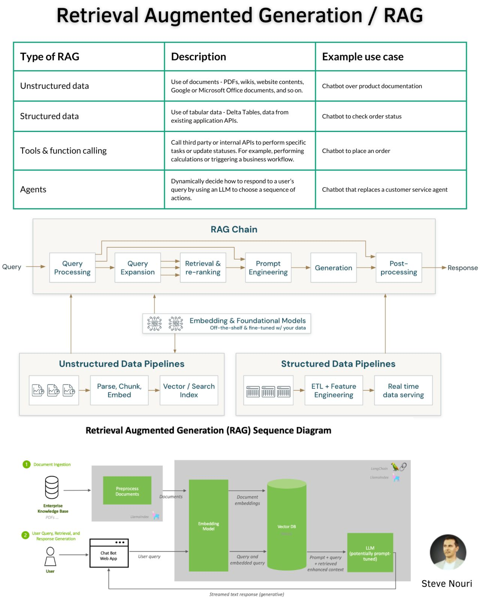

## Retrieval Augmented Generation (RAG)

Different types of RAG:

1. Original RAG
2. Graph RAG
3. LongRAG
4. Self-RAG
5. Corrective RAG
6. EfficientRAG
7. Golden-Retriever
8. Adaptive RAG
9. Modular RAG
10. Speculative RAG
11. RankRAG
12. Multi-Head RAG

### Chunking

Breaking down the input text into smaller parts, called chunks, is a common technique used in many NLP tasks. In the
context of RAG, chunking is used to break down the input text into smaller parts, which can then be used to generate
relevant responses.

#### Chunking Strategies

Fixed-size

- Naive chunking. Divides text into equal-sized chunks, simple but may break semantic units.
- Can be count based or recursive

## Retrieval

### Measuring Retrieval Quality

Measure what matters. Choose the right metric.

* Precision: How many retrieved items are relevant?
* Recall: How many relevant items were retrieved?
* MRR: How relevant is the top hit?
* MAP: How is the average precision across all queries?
* NDCG: How well-ordered are the results?
