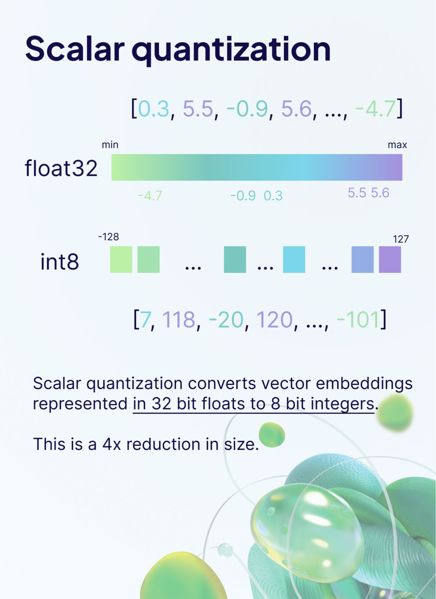

## Introduction

1. [Chapter 1     - What Is Generative AI](What_Is_Generative_AI.md)
2. [Chapter 2 & 3 - Getting Started with LangChain](Getting_Started_with_LangChain.md)
3. [Chapter 4     - Building Capable Assistants](Building_Capable_Assistants.md)
4. [Chapter 5     - RAG](RAG.md)

## Tokens

Tokens are the smallest unit of text that a language model can understand.
Use [this tool](https://platform.openai.com/tokenizer) to understand how some OpenAI models tokenize
text: https://platform.openai.com/tokenizer.

```one plus one is two``` is tokenized as ```['one', 'plus', 'one', 'is', 'two']```. **5 tokens.**

## Models

To run LLM's locally, we can use `Ollama` or `GPT4All`.

### Ollama

We use `ollama` to manage local models. It stores the downloaded models under `~/.ollama/models` which contains both
model blobs and manifests.

- **Model blobs** are large binary objects that store the actual parameters and data of a machine learning model,
  essential for making predictions or further training.
- **Manifests** provide metadata and information about a machine learning model, including its architecture,
  hyperparameters, and version information, facilitating model selection and integration into production systems.

Download and install the desktop application: https://ollama.com/download

> You can get the list of models supported by ollama here: https://ollama.com/library

### GPT4All

Download and install the desktop application: https://docs.gpt4all.io/index.html
You can use the app to download the models. It stores the downloaded models under `~/.cache/gpt4all/` which contains
both
model blobs and manifests.
> You can get the list of models supported by ollama here: https://docs.gpt4all.io/gpt4all_desktop/models.html

### RAG

For a current Retrieval-Augmented Generation (RAG) project, fine-tuning every parameter to ensure high-quality outputs.

- Beyond adjusting temperature or token limits, tweaking parameters like top-k (how many answer options to consider),
  top-p (how random the choices are), and frequency penalties (to avoid repeating answers).
- Combine that with smart retrieval—like choosing between keyword, semantic or hybrid search and deciding how many
  documents to pull—and you're not just pulling data; you're shaping it into meaningful insights.
- Building the right Large Language Model RAG system is a lot about experimentation—there’s no one-size-fits-all.

### Evaluation

Not all retrieval metrics are created equal.

* Precision: How many retrieved items are relevant?
* Recall: How many relevant items were retrieved?
* MRR: How relevant is the top hit?
* MAP: How is the average precision across all queries?
* NDCG: How well-ordered are the results?

Measure what matters. Choose the right metric.

## Tools

All tools (DuckDuckGo Search, wikipedia etc.) have their specific purpose that is part of the description. **This
description is passed to the LLMs to provide context and help them generate better responses.**

## Quantization

Replace a continuous value with a discrete value. Quantization, in mathematics and digital signal
processing, is the process of mapping input values from a large set to output values in a smaller set, often with a
finite number of elements. Rounding and truncation are typical examples of quantization processes.

In the context of LLMs, quantization is used to reduce the number of bits used to represent the weights of the model.
This can lead to a smaller model size and faster inference times, but may also result in a loss of precision.

### Scalar Quantization

Scalar quantization reduces the memory of your embeddings by 4x. In a nutshell, scalar quantization converts float to
integer representation. That’s 32 bits per dimension to 8 bits per dimension. That’s a 4x memory reduction.

How does it work?

1. Take the min and max
2. Divide range into 256 bins
3. Convert float32s to 8 bit integers

While this is a lossy compression and can lead to some performance losses, it will also save you memory and cost and
speed up search.



## Reference

- [Chunking Visualizer](https://chunkviz.up.railway.app/)